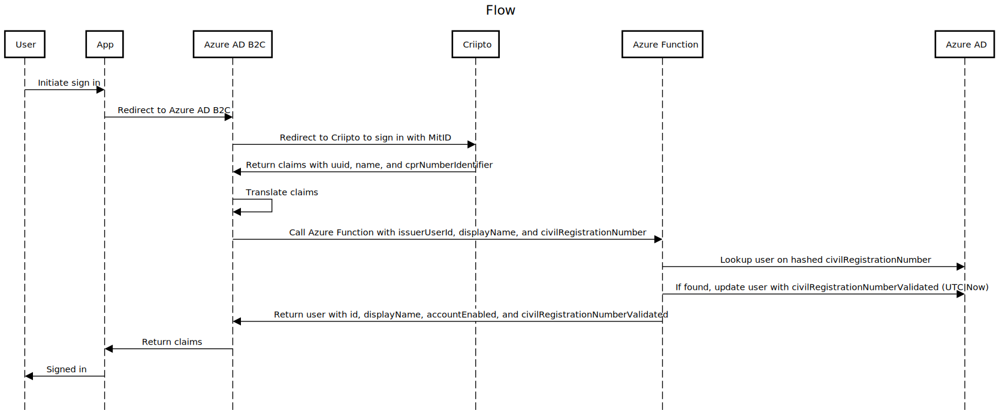

# Azure AD B2C - MitID integration

Sample app demonstrating how to use Azure AD B2C with [MitID](https://www.mitid.dk/) to validate a citizens civil registration number (colloquially: CPR number) and write back a custom attribute in the corporate Azure AD.

This is done to be [NSIS](https://digst.dk/it-loesninger/standarder/nsis/) compliant.

## Use cases

- Use MitID to ensure a given user has validated her civil registration number (this sample).
- Use MitID to enable a disabled account.
- Use MitID to perform a password reset.

## Prerequisites

1. Create an account on <https://www.criipto.com/> and create an App Registration on their side. Capture client id and client secret.
1. For production: All users should have their civil registration number (ten digits, no dash) stored in Azure AD (value to be hashed using SHA256 and subsequently base64 encoded).

## Flow



Source from <https://sequencediagram.org/>:

```txt
title Flow

User->App:Initiate sign in
App->Azure AD B2C:Redirect to Azure AD B2C
Azure AD B2C->Criipto:Redirect to Criipto to sign in with MitID
Criipto->Azure AD B2C:Return claims with uuid, name, and cprNumberIdentifier
Azure AD B2C->Azure AD B2C: Translate claims
Azure AD B2C->Azure Function:Call Azure Function with issuerUserId, displayName, and civilRegistrationNumber
Azure Function->Azure AD:Lookup user on hashed civilRegistrationNumber
Azure Function->Azure AD:If found, update user with civilRegistrationNumberValidated (UTC Now)
Azure Function->Azure AD B2C:Return user with id, displayName, accountEnabled, and civilRegistrationNumberValidated
Azure AD B2C->App:Return claims
App->User:Signed in
```

## Setup

1. Clone code
1. Search and replace all instances of `ondfiskb2c` with `<your-azure-ad-b2c-tenant-name>`
1. Search and replace all instances of `ondfisk` with `<your-azure-ad-tenant-name>`

## Azure AD

### Create test user

```http
POST https://graph.microsoft.com/v1.0/users

{
    "accountEnabled": true,
    "displayName": "Åge Petersen",
    "givenName": "Åge",
    "surname": "Petersen",
    "mailNickname": "aagep",
    "passwordProfile": {
        "forceChangePasswordNextSignIn": true,
        "forceChangePasswordNextSignInWithMfa": false,
        "password": "..."
    },
    "userPrincipalName": "aagep@ondfisk.dk",
    "jobTitle": "Senior Tester"
}
```

Capture `id`:

- `id`: `e110ccf5-f660-4777-ace0-ed9c56f04981`

### Create app registration for storing user data

```http
POST https://graph.microsoft.com/v1.0/applications/
Content-type: application/json

{
    "displayName": "ondfisk extensions app - DO NOT DELETE",
    "description": "ondfisk extensions app. Reserved for directory extensions. DO NOT DELETE. Used by ondfisk for storing user data.",
    "signInAudience": "AzureADMyOrg",
    "tags": [
        "Directory extensions",
        "Extensions",
        "Extension attributes"
    ]
}
```

Capture `id` and `appId`

- `id`: `c45cf23e-e189-4b24-95d7-8814c4d09736`
- `appId`: `1be97e58-6e49-44ee-a17a-42fd1fc944cf`

### Create service principal for app

```http
POST https://graph.microsoft.com/v1.0/servicePrincipals

{
    "appId": "1be97e58-6e49-44ee-a17a-42fd1fc944cf"
}
```

### Create directory extension definitions

```http
POST https://graph.microsoft.com/v1.0/applications/c45cf23e-e189-4b24-95d7-8814c4d09736/extensionProperties
Content-type: application/json

{
    "name": "civilRegistrationNumber",
    "dataType": "String",
    "targetObjects": [
        "User"
    ]
}
```

```http
POST https://graph.microsoft.com/v1.0/applications/c45cf23e-e189-4b24-95d7-8814c4d09736/extensionProperties
Content-type: application/json

{
    "name": "civilRegistrationNumberValidated",
    "dataType": "DateTime",
    "targetObjects": [
        "User"
    ]
}
```

### Compute civil registration number hash for test user

```powershell
$civilRegistrationNumber = "0905540335"
$bytes = [System.Text.Encoding]::UTF8.GetBytes($civilRegistrationNumber)
$hash = [System.Security.Cryptography.SHA256]::HashData($bytes)
$base64 = [System.Convert]::ToBase64String($hash)
$base64
```

### Update civil registration number hash on test user

```http
PATCH https://graph.microsoft.com/v1.0/users/e110ccf5-f660-4777-ace0-ed9c56f04981

{
    "extension_1be97e586e4944eea17a42fd1fc944cf_civilRegistrationNumber": "yqaVIggNuNCpgvScLH9GdX0gB3LMo+LUuGc8Jv+bxSc="
}
```

## Azure

Deploy resources:

```bash
./infrastructure/deploy.sh
```

### Azure Functions

Under `/src/Ondfisk.B2C.Functions`, create a `local.settings.json`:

```json
{
  "IsEncrypted": false,
  "Values": {
    "AzureWebJobsStorage": "",
    "FUNCTIONS_WORKER_RUNTIME": "dotnet-isolated"
  }
}
```

Deploy `/src/Ondfisk.B2C.Functions`.

Capture the *default function key* from the `ValidateUser` function.

## Azure AD B2C

1. [Add signing and encryption keys for Identity Experience Framework applications](https://learn.microsoft.com/en-us/azure/active-directory-b2c/tutorial-create-user-flows?pivots=b2c-custom-policy#add-signing-and-encryption-keys-for-identity-experience-framework-applications)
1. [Register Identity Experience Framework applications](https://learn.microsoft.com/en-us/azure/active-directory-b2c/tutorial-create-user-flows?pivots=b2c-custom-policy#register-identity-experience-framework-applications)
1. Configure App Registration:

    - Name: `jwt.ms`
    - Supported account types: `Accounts in any identity provider or organizational directory (for authenticating users with user flows)`
    - Redirect URI (recommended): `Single-page application (SPA)` `https://jwt.ms`
    - Permissions: `[X]` Grant admin consent to openid and offline_access permissions
    - Authentication/Implicit grant and hybrid flows: `[X]` Access tokens (used for implicit flows)

### Configure Application Insights for Azure AD B2C

Using your newly created Application Insights resource follow this guide:

[Collect Azure Active Directory B2C logs with Application Insights](https://learn.microsoft.com/en-us/azure/active-directory-b2c/troubleshoot-with-application-insights?pivots%253Db2c-custom-policy#see-the-logs-in-application-insights)

### Update policies

Using the data from your Criipto App Registration:

- Update `policies/TrustFrameworkExtensions.xml` with client id
- Create policy key `MitIDClientSecret` with client secret
- Create policy key `FunctionsKey` with function key

### Upload policies

Upload `/policies`.

## Test

You should now be able to test your app registration using:

- Username: Åge29164
- Password: ZXzx11^x
- CPR number: 0905540335
